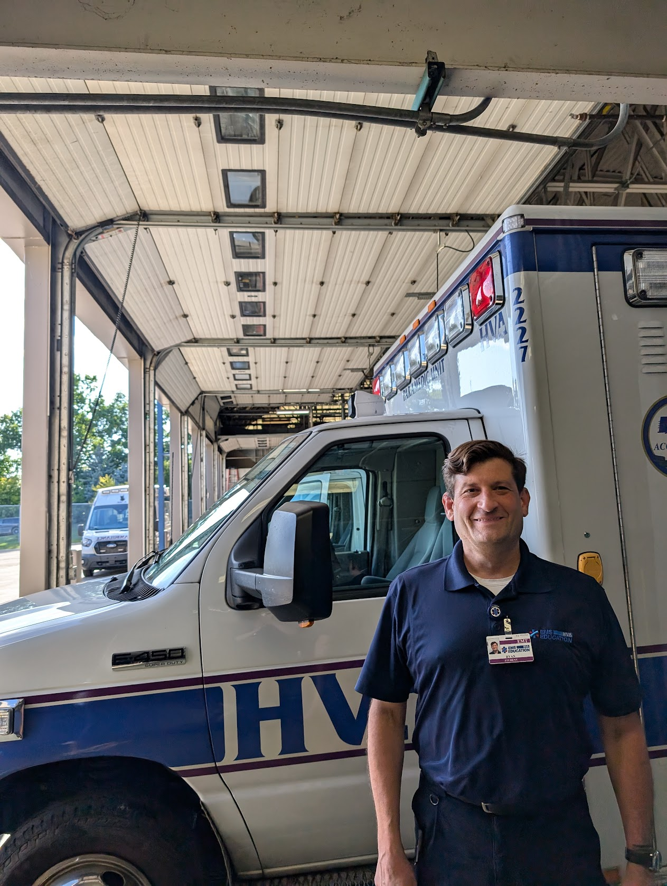

+++
date = '2025-08-18T02:01:29-04:00'
title = 'Tech Employment Sabbatical'
tags = [ "people", ]
cover = 'ry4an_ambulance.jpg'
+++

After 30 years of steady employment in the tech industry I've gotten the family
on board with my taking a one year sabbatical.  My employer didn't offer
extended unpaid time off as a benefit, so I resigned in June and am now two
months into a year's leave.  I'm hoping to return to the tech industry
re-energized and with some new perspectives.  I'd be kidding if I didn't say the
current tech job market is concerning relative to when I first made this
decision, but I'm counting on a large network of past coworkers and some
AI-resistant skills to smooth my reentry in 2026.

Already, with just a few months' distance, I'm finding myself diving into
personal tech projects that I've been wanting to do for years, but couldn't
summon the energy to start.  So far it's all small stuff like a [blog
revamp](/unblog/post/unblog-generation-four/), but I'm ramping up on
hobbyist-grade [home automation](/unblog/tags/home/) stuff.

I became an EMT in 2024, and now with more time and energy on my hands I'm
picking up a few ambulance shifts each week.  As a hobby and side-gig it's fun
and rewarding.  I get to meet new people each day, see into a lot of strangers'
homes, and work with young, energetic coworkers.  I start paramedic training in
September, which at 14 months will overlap my return to tech, but at the end
I'll have a much wider scope of practice to use on night and weekend shifts.

See you back in the pixel mines in June 2026!

